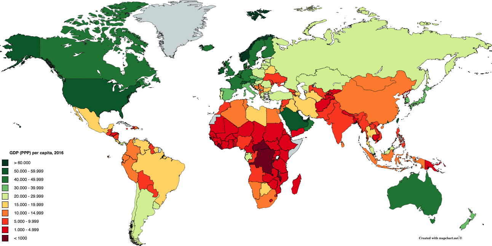

GDP and Future Orientation
========================================================

## Overview:

This project reproduce the findings of the article at <http://www.nature.com/articles/srep00350>. According to the findings, the GDP/capita of countries are positively correlated to how much their population searches for the next year, relative to how much it searches for the previous year. This ratio is dubbed the Future Orientation Index (FOI). So for example for the year 2017 the FOI can be calculated as: FOI = number of searches for the term "2018" / number of searches for the term "2016".


### Installation

<span style="color:maroon">
Install the required packages.
<span>

Run the following commands in your R console to install WDI and gtrendsR.

```
install.packages("WDI")
install.packages("devtools")
if (!require("devtools")) install.packages("devtools")
devtools::install_github("PMassicotte/gtrendsR")
```

### World Bank Dat (WDI)

We will use WDI to load data on GDP/capita and number of internet users per country from the World Development Indicators.

<span style="color:maroon">
Load the WDI package.
<span>

```{r}
require(WDI)
```

<span style="color:maroon">
Extract the needed data.
</span>

We need the Gross Domestic Produce (GDP) per capita corrected by the Purchase Power Parity (PPP). PPP is a way to compare GDP by accounting for cost of goods in the country rather than market exchange. The GDP per capita PPP data reflects more what citizens of the country can buy. In the WDI database this is referred to as NY.GDP.PCAP.PP.KD. (this indicator can be found using the WDIsearch function - see the WDI reference for details if you are interested in finding other data: <https://cran.r-project.org/web/packages/WDI/WDI.pdf>). We need data from all countries in the year 2016. Below is a map of countries with GDP per capita PPP as colour.



```{r}
table = WDI(indicator=c('NY.GDP.PCAP.PP.KD','IT.NET.BBND','SP.POP.TOTL'), country='all', start = 2016, end = 2016, extra = TRUE)
summary(table)
```

The summary gave a nice overview of our data. Additionally, we can use the head() function to take a look at what the actual data in the table looks like

```{r}
head(table)
```

<span style="color:maroon">
Remove unwanted entries.
<span>

It seems like some of the entries are not countries, but regions! We can remove them by comparing whether the region field is equal to 'Aggregates'. And we added a column column called "FOI" to calculate the FOI value for the future.


```{r}
table = table[complete.cases(table),]
table = table[!(table$region=='Aggregates'),]
table = subset(table, select = c("iso2c", "country", "NY.GDP.PCAP.PP.KD", "IT.NET.BBND", "SP.POP.TOTL"))
table["INT.POP"]=table["IT.NET.BBND"]

table["IT.NET.USER.P3"]=NULL
table["SP.POP.TOTL"]=NULL

table$FOI = NA
```

Additionally, countries with less than 5 million inhabitants are removed. The article mentioned above did this to remove outliers
```{r}
table=table[!(table$INT.POP<5000000),]
```


### Google Trends

<span style="color:maroon">
Set up gtrendsR
<span>

Log in to Google using your username and password. code not shown.


```{r echo=FALSE}
# 
# username = "dstestah"
# password = "test pass ah"
# ch = gconnect(username,password)

if (!require("devtools")) install.packages("devtools")
devtools::install_github("PMassicotte/gtrendsR")
require(gtrendsR)
```

<span style="color:maroon">
Extract data from Google Trends.
<span>

For each country we need the FOI, which is the ratio between the volume of searches for "2015" and "2013". Note that with Google Trends we can query a maximum of 5 countries at a time, so we won't get all the data in one go. Rather it is worth making a for loop that goes through all the country codes.

Google Trends doesn't give absolute volumes, but relative ones. It always sets the largest data to 100 and scales the rest accordingly. However if you search for two things at the same time, or two countries at the same time, the results will have the correct proportion to each other. This means that to get the correct FOI, for each country code you need to extract data for "2015" and "2013" searches in the same go! In other words you should only have one call of the gtrends function in your for loop.

```{r}
# start_date = as.Date("2016-01-01")
# end_date = as.Date("2017-01-01")
i=1
for(current_country in table[,"iso2c"])
  {
    print(current_country)

    result=gtrends(c("2015","2017"),geo=current_country, time="2016-01-01 2017-01-01")
    
    FOI=sum(result$interest_over_time$hits[result$interest_over_time$keyword=='2017'])/sum(result$interest_over_time$hits[result$interest_over_time$keyword=='2015'])
    print(FOI)
    table[i,'FOI']=FOI
    i=i+1
}

#table = table[complete.cases(table),]
```

<span style="color:maroon">
Regress GDP per capita PPP on FOI and plot
<span>

Now that we have the FOI index and GDP per capita, PPP value for each country, we can make a regression and plot the result. 

```{r}
reg = lm(NY.GDP.PCAP.PP.KD~FOI, data=table)
summary(reg)
plot(table$FOI, table$NY.GDP.PCAP.PP.KD, main='GDP vs Future orientation', ylab='GDP per capita PPP', xlab='Future Orientation Index')
text(table$FOI, table$NY.GDP.PCAP.PP.KD, labels=table$iso2c, cex= 0.7, pos=3)
abline(reg, col='red')
```

We can see in this plot that there is a positive correlation between FOI and GDP per capita PPP value. And the relationship is statistically significant. (high t value and low p value)

One might be quick to conclude that countries that look towards the future caused them to be richer. However determining causality is much more complicated, there are more than 1 possible explanation for the result. An alternative explanation could be that richer countries have more necessities taken care of and have the ability to look forward.


