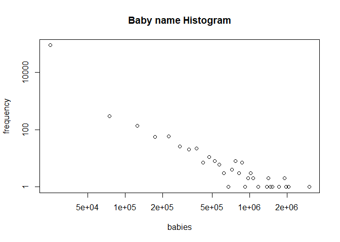
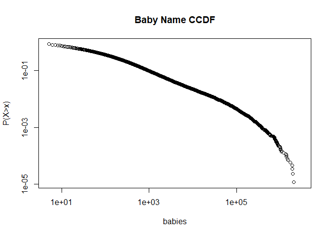
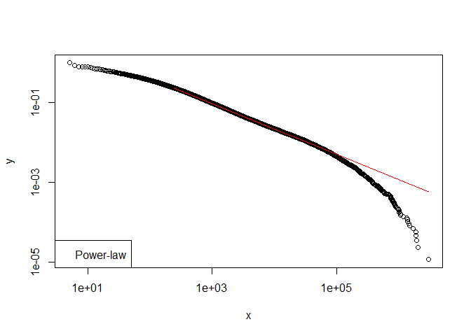
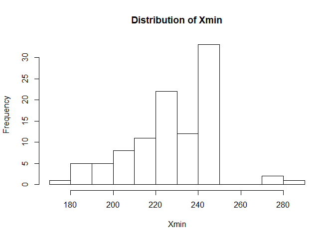
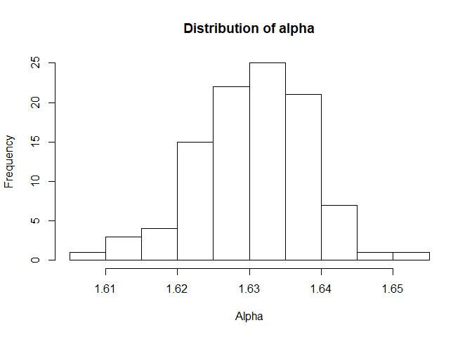
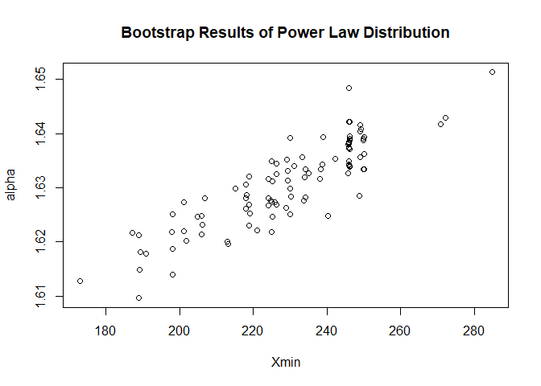
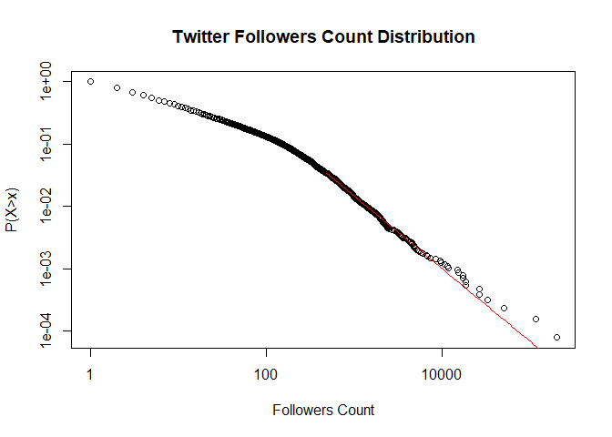
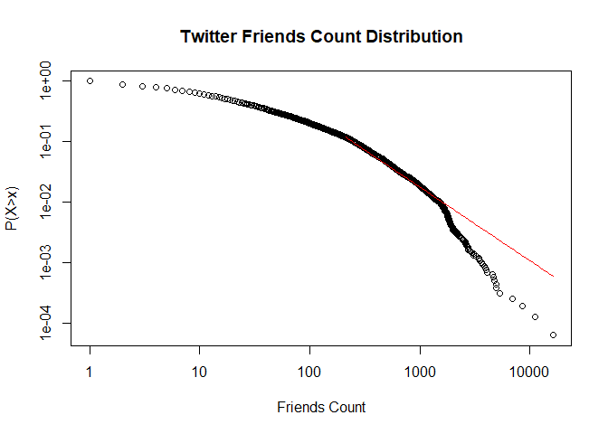

Power-law and Log-Normal Distributions
================

Fitting Power-law and Log-Normal Distributions
----------------------------------------------

### Part 1:

Some names are more popular than others. When you meet a stranger, it is much more likely to meet a James than an Edmund. But just how are baby names distributed? This project will try to find out. I will be using US baby names as it is a big country and the data is easily accessible.

### Retrieve Baby name Data

Retrieve data from the US government website

``` r
URL = "https://www.ssa.gov/oact/babynames/names.zip"
dir.create("data")
download.file(URL, destfile = "./data/babyname.zip")
unzip("./data/babyname.zip", exdir = "./data")
```

The data set contains all the baby names from 1960 to 2015. Each file contains a list of names and the count of babies with this name of a certain year. I first aggregate all the counts for each name into one big table.

``` r
library(dplyr)

table=data.frame()
for( i in 1960:2015){
  
filename= paste("./data/yob", i, ".txt", sep = "")
table = rbind(table ,read.csv(file=filename, header=FALSE, sep = ',', stringsAsFactors = FALSE))

}
colnames(table) = c("name", "gender", "count")
table = aggregate(count~name, data=table, FUN=sum)
table = table[order(table$count, decreasing = TRUE),]
head(table)
```

    ##              name   count
    ## 56373     Michael 3029928
    ## 19317       David 2082048
    ## 33970       James 1987183
    ## 38114        John 1911465
    ## 15737 Christopher 1910203
    ## 66791      Robert 1731062

It worked!

Now let's plot the histogram of the baby names and see how it is distributed.

``` r
count = table$count
x <- hist(count, plot=FALSE,breaks=100)
plot(x$mids, x$counts, log="xy", main = "Baby name Histogram", ylab ='frequency', xlab='babies')
```

    ## Warning in xy.coords(x, y, xlabel, ylabel, log): 29 y values <= 0 omitted
    ## from logarithmic plot

 This seems like a power-law distribution. A power-law distribution is a straight line on a log-log histogram plot. The equation of power-law is: distribution is:

*f*(*x*)=(*c**x*)<sup>−*α*</sup>

where *α* is the power of the distribution

Let's also take a look at the complementary cumulative density distribution (CCDF). If the distribution is power law, it should also form a straight line.

``` r
library(magrittr)

X = table$count
CCDF = ecdf(X)
xval = sort(unique(X))
yval = CCDF(xval)
plot(xval, 1-yval,log = "xy", main="Baby Name CCDF", ylab="P(X>x)", xlab='Number of Babies')
```

    ## Warning in xy.coords(x, y, xlabel, ylabel, log): 1 y value <= 0 omitted
    ## from logarithmic plot



Here I use the 'PoweRlaw' package to fit a distribution of the baby names by minimizing the ks distance (largest distance between data and function).

``` r
require(poweRlaw)
```

    ## Loading required package: poweRlaw

``` r
mm=displ$new(table$count)
mm$getXmin()
```

    ## [1] 5

``` r
mm$getPars()
```

    ## NULL

``` r
(est=estimate_pars(mm))
```

    ## $pars
    ## [1] 1.387608
    ## 
    ## $value
    ## [1] 524796.9
    ## 
    ## $counts
    ## function gradient 
    ##        5        5 
    ## 
    ## $convergence
    ## [1] 0
    ## 
    ## $message
    ## [1] "CONVERGENCE: REL_REDUCTION_OF_F <= FACTR*EPSMCH"
    ## 
    ## attr(,"class")
    ## [1] "estimate_pars"

``` r
(est=estimate_xmin(mm))
```

    ## $gof
    ## [1] 0.02208462
    ## 
    ## $xmin
    ## [1] 240
    ## 
    ## $pars
    ## [1] 1.633256
    ## 
    ## $ntail
    ## [1] 20631
    ## 
    ## $distance
    ## [1] "ks"
    ## 
    ## attr(,"class")
    ## [1] "estimate_xmin"

``` r
mm$setXmin(est)
plot(mm, ylab="P(X>x)", xlab='Number of Babies')
lines(mm, col=2)
legend("topright", "Power-law", col="red")
```



We see that at the tail the function drops down quite a bit. Power-law might not be the best fit.

Using bootstrapping, we can find out the probability that the data follows a distribution. Bootstrapping is sampling the data with replacement to form multiple data samples. Each sample will return a parameter for *α* and *c*. This part takes some time to run.

``` r
bs=bootstrap(mm, no_of_sims = 100, threads = 8)
```

    ## Some of your data is larger than xmax. The xmax parameter is
    ##             the upper bound of the xmin search space. You could try increasing
    ##             it. If the estimated values are below xmax, it's probably OK not to 
    ##             worry about this.

    ## Expected total run time for 100 sims, using 8 threads is 5930 seconds.

``` r
hist(bs$bootstraps[,2], breaks="fd", main = 'Distribution of Xmin',xlab='Xmin')
```



``` r
hist(bs$bootstraps[,3], breaks="fd", main = 'Distribution of alpha',xlab='Alpha')
```



``` r
plot(jitter(bs$bootstraps[,2], factor=1.2), bs$bootstraps[,3], xlab='Xmin', ylab='alpha', main='Bootstrap Results of Power Law Distribution')
```



``` r
bs_p=bootstrap_p(mm, no_of_sims = 100, threads=8)
```

    ## Some of your data is larger than xmax. The xmax parameter is
    ##             the upper bound of the xmin search space. You could try increasing
    ##             it. If the estimated values are below xmax, it's probably OK not to 
    ##             worry about this.

    ## Expected total run time for 100 sims, using 8 threads is 5680 seconds.

``` r
bs_p$p
```

    ## [1] 0.55

The above chunk of code uses bootstrapping to find a distribution of X\_min and alpha and plots the distributions. However it takes too long to run, so it is left commented at the moment. bs\_p$p shows the p value of the distribution being a power-law distribution. High p value means the distribution is likely to follow power-law.

The result might not be a power-law distribution, we can try to fit a log-normal distribution instead. Let's see if the fit is better. Log-normal distribution is defined by the following formula.
$$f(x) =  c \\frac{1}{x^{p}}\\, \\exp\\!\\!\\left(-\\frac{\\ln(x/\\mu)^2}{2\\sigma^2}\\right)$$

Where the log of the distribution follows a Gaussian distribution.

``` r
mm2 = dislnorm$new(X)
#mm2$setXmin(30145) #If you want to analyze the top 1000
est2 = estimate_pars(mm2)
mm2$setPars(est2)
plot(mm,xlab="Baby name sample",ylab="Baby name counts", main="Power Law vs Log Normal Fit")
lines(mm, col=2)
lines(mm2, col=3)
legend("bottomleft", c("power-law","log-normal"), col=c(2,3), lwd=c(1,1))
```


In this case the Log-normal distribution seems to be a better fit.

### Part 2: Twitter data

Let's see if Twitter user's attributes (i.e. friends count, followers count) follow the power-law distribution.

Log in to Twitter using the 'twitteR' package using your log in. The code is not shown.

    ## Loading required package: twitteR

    ## 
    ## Attaching package: 'twitteR'

    ## The following objects are masked from 'package:dplyr':
    ## 
    ##     id, location

    ## [1] "Using direct authentication"

Lookup 20k Twitter users by searching random Twitter IDs. This part takes time to run. To get the power law distribution, we need sufficiently large number of samples, otherwise we can't see the fat tail.

``` r
users=list()
while(length(users)<=20000){
  rate=getCurRateLimitInfo()
  
  while(as.numeric(rate$remaining[rate$resource=="/users/lookup"])<20){
    #the sleep is for waiting to reset the Twitter quota.
    Sys.sleep(100)
    rate=getCurRateLimitInfo()
    
    if(as.numeric(rate$remaining[rate$resource=="/users/lookup"])>=20){
      setup_twitter_oauth(consumer_key, consumer_secret, access_token, access_secret)
    }
  }
  
  a=ceiling(runif(2000, min=0, max=3E9))
  users=unique(c(lookupUsers(a),users))
}
```

### Cleaning up the data and convert to a table

Initialize data frame

``` r
twtable=data.frame(matrix(0, ncol=5, nrow=length(users)))
colnames(twtable)=c("users", "status_count", "follower_count", "favorites_count", "friends_count")
```

Sort results

``` r
i=1
for (person in users){
  twtable$users[i] = person$screenName
  twtable$status_count[i] = sort(person$statusesCount)
  twtable$follower_count[i] = person$followersCount
  twtable$favorites_count[i] = person$favoritesCount
  twtable$friends_count[i] = person$friendsCount
  i=i+1
}
```

### Plotting the Distributions

``` r
require(poweRlaw)


mm=displ$new(twtable$follower_count[twtable$follower_count!=0])
(est=estimate_pars(mm))
```

    ## $pars
    ## [1] 1.371277
    ## 
    ## $value
    ## [1] 52068.52
    ## 
    ## $counts
    ## function gradient 
    ##        6        6 
    ## 
    ## $convergence
    ## [1] 0
    ## 
    ## $message
    ## [1] "CONVERGENCE: REL_REDUCTION_OF_F <= FACTR*EPSMCH"
    ## 
    ## attr(,"class")
    ## [1] "estimate_pars"

``` r
(est=estimate_xmin(mm))
```

    ## $gof
    ## [1] 0.02136918
    ## 
    ## $xmin
    ## [1] 334
    ## 
    ## $pars
    ## [1] 2.161383
    ## 
    ## $ntail
    ## [1] 609
    ## 
    ## $distance
    ## [1] "ks"
    ## 
    ## attr(,"class")
    ## [1] "estimate_xmin"

``` r
mm$setXmin(est)
plot(mm, main='Twitter Followers Count Distribution', ylab='P(X>x)', xlab='Followers Count')
lines(mm, col=2)
```



``` r
mm=displ$new(twtable$friends_count[twtable$friends_count!=0])
(est=estimate_pars(mm))
```

    ## $pars
    ## [1] 1.29106
    ## 
    ## $value
    ## [1] 80259.64
    ## 
    ## $counts
    ## function gradient 
    ##        6        6 
    ## 
    ## $convergence
    ## [1] 0
    ## 
    ## $message
    ## [1] "CONVERGENCE: REL_REDUCTION_OF_F <= FACTR*EPSMCH"
    ## 
    ## attr(,"class")
    ## [1] "estimate_pars"

``` r
(est=estimate_xmin(mm))
```

    ## $gof
    ## [1] 0.04697419
    ## 
    ## $xmin
    ## [1] 376
    ## 
    ## $pars
    ## [1] 2.434236
    ## 
    ## $ntail
    ## [1] 936
    ## 
    ## $distance
    ## [1] "ks"
    ## 
    ## attr(,"class")
    ## [1] "estimate_xmin"

``` r
mm$setXmin(est)
plot(mm, main='Twitter Friends Count Distribution', ylab='P(X>x)', xlab='Friends Count')
lines(mm, col=2)
```



It could be argue that both of these distribution are power-law distributions or other distributions. In real life it is hard to pin point the distribution with 100% certainty. However in these cases power-law does seem to be a good fit.
