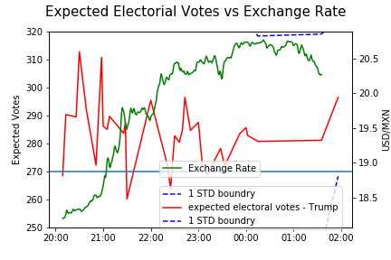
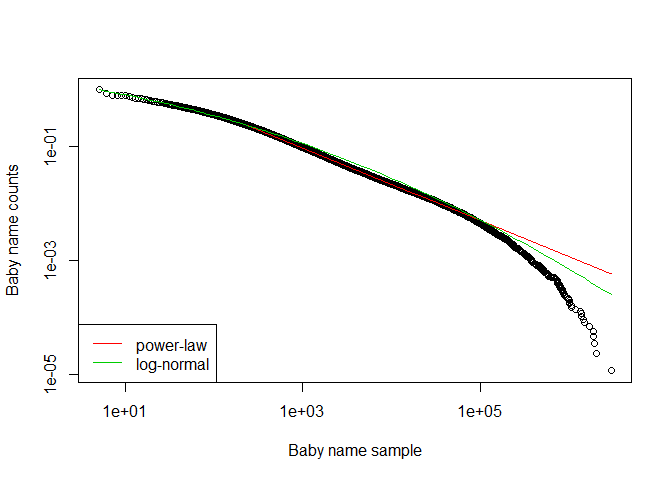
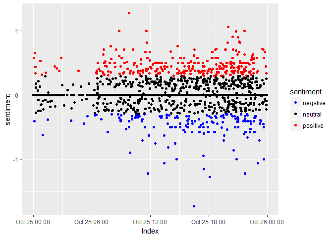

# Data Science Portfolio
 
A repository of the projects I worked on or currently working on. It is updated regularly. The projects are either written in R (R markdown) or Python (Jupyter Notebook). Click on the projects to see full analysis and code.

Please contact me on [Linkedin](https://www.linkedin.com/in/alexzilihuang) if you are looking to hire a data scientist.
 
## Projects:

###  [Anomaly Detection on Beijing pm2.5 data using LSTM - Under Construction](https://github.com/alexhuang1117/personal_projects/tree/master/pm25_analysis)

* Used LSTM to fit five years of Beijing weather data 
* Constructed anomaly scores from the difference between model prediction and real data
* Investigated time periods with high anomaly scores
* Results confirms that high anomaly scores corresponds with extreme weather (floods, heavy rain, firework celebration, etc)
* **Keywords**(Anomaly Detection, Time Series, LSTM, Weather, Beijing, Semi-supervised learning)

---
 
###  [Exchange Rate Analysis During US Election](https://github.com/alexhuang1117/Data-Science-Portfolio/blob/master/FX_Analysis_During_US_Election/main.ipynb)
* Predicted US (2016) election results in realtime as the voting results of each region becomes available.
* Regressed states with results against polling data and predicted results for the remaining states
* Monte Carlos simulation used to simulate the winner of the election.
* Compared simulated results with exchange rates fluctuations to see if market is efficient.
* **Keywords**(Python, Linear Regression, Monte Carlos Simulation)

 
 
---
 
###  [Power-law or Log-normal? Baby Name and Twitter Analysis](https://github.com/alexhuang1117/Data-Science-Portfolio/blob/master/Power_Law_vs_Lognormal_US_Babynames/Power_Law_vs_Lognormal_US_Babynames.md)
* Fitted power-law and log-normal distribution to US baby names data since 1960.
* Use bootstrapping techniques to find a distribution of the power-law parameters
* Crawled Twitter to find 20000 random user and fitted power law distribution to users' friends count and followers count.
* **Keywords**(R, Power-law, Bootstrapping, Log-normal)

 
---
 
 
### [Twitter Sentiment Daily and Weekly Fluctuations](https://github.com/alexhuang1117/Data-Science-Portfolio/blob/master/Twitter_Sentiement_Analysis/Twitter_sentiment_Analysis.md)
* Parsed a few GB of Tweets to select all the tweets in UK and in English.
* Used 'qdap' package to analyze the emotion of the Tweets
* Plotted the emotions over the day and over the week and analysed the interesting results.
* **Keywords**(R, Twitter API, Time Series, Sentiment Analysis, ggplot)
  
---
 
 
### [GDP and Future Orientation](https://github.com/alexhuang1117/Data-Science-Portfolio/blob/master/GDP%20and%20Future%20Orientation/GDP_and_Future_Orientation.md)
* Downloaded economic indicators data using World Bank API, and cleaned data
* Downloaded search query of next and last year in Google for each country
* Fitted linear regression between GDP and future orientation
* **Keywords**(R, World Bank API, Google API, Data Cleaning, Linear regression)
  
 
---
 
###  [Exchange Rate Analysis During UK Election - Under Construction](https://github.com/alexhuang1117/Data-Science-Portfolio/blob/master/FX_Analysis_during_UK_Election/main.ipynb)
* Predicted UK (2017) election victories as the voting results as it happened.
* retrieved from Tweets of result announcement and extracted time of announcement for each region.
* Regressed regions with results against polling data and predicted results for the remaining regions
* Monte Carlos simulation used to simulate the winner of the election.
* **Keywords**(Python, Twitter API, Merging Data)
 
 
